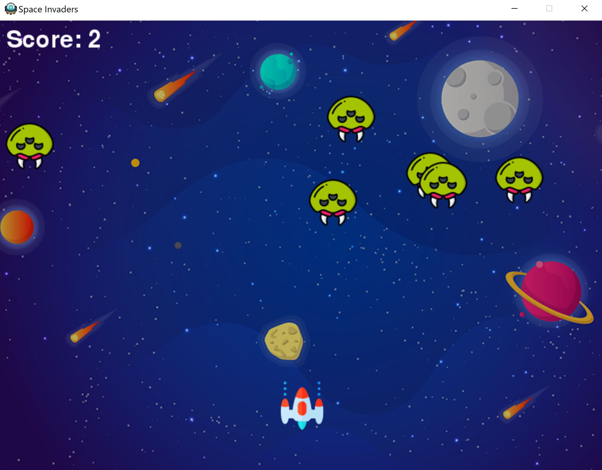

# SpaceInvader
A first game in python about space Invader with pygame.

Player's control to play:
Left arrow to move left the spaceship
Right arrow to move right the spaceship
Space to fire 

Below an image of the play:

References to tutorial --> freeCodeCamp.org 

References to icon/image -->"Icon made by Pixel perfect from www.flaticon.com"
